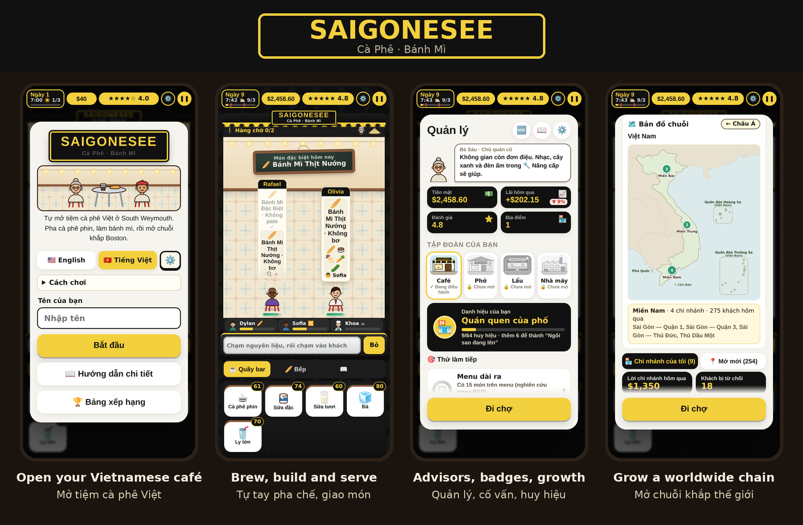

# Saigonesee ☕🥖

**A Saigonesee game · Một sản phẩm của Saigonesee**

[English](#english) · [Tiếng Việt](#tiếng-việt)

---

## English

Run your own Vietnamese café in South Weymouth: brew phin coffee, build bánh mì, and grow into a chain of cafés, phở and hotpot restaurants across North America and Asia.

### ▶ Play now

The game link is in the **About** section on the right side of this page. It runs in your browser, nothing to install.

**iPhone:** open the link in Safari → Share → **Add to Home Screen**. The game gets its own icon, just like an app.

**Android:** open the link in Chrome → menu ⋮ → **Add to Home screen**.

### How to play

1. Each morning, stock up at the **Market**, then open the shop.
2. Read each guest's order slip, **tap the ingredients** to make it, then **tap the guest** to serve.
3. Fast, correct orders earn tips and stars. Guests who wait too long walk out.
4. At night, check your profit, then use **Manage** to hire staff, buy upgrades, research new dishes and open branches.

The first 3 days show ingredient hints, so new players can pick it up right away.

### What's inside

- **A Saigon street café:** gạch bông floor tiles, red plastic stools, and a chalkboard with the special of the day.
- **60 café items** (phin coffee, bạc xỉu, egg coffee, bánh mì…), plus **phở** and **hotpot** menus, 20 recipes to discover and your own inventions in the **Lab**.
- **Staff and regulars:** hire, train and promote your team. Regulars come back for their favorite.
- **Expansion:** branches across the United States, Canada, Mexico, Vietnam and Asia, with a **chain map** for each country.
- **Real business:** pricing, competitors, marketing, loans, going public, investing, a coffee farm in Buôn Ma Thuột and a Mini Mart chain.
- **Advisors** in every section and a **four-part rating** (price, food, service, atmosphere) that tells you what to improve.
- **64 badges, 8 titles** and a shared **leaderboard**.
- English and Vietnamese.

### Saving your progress

Progress is saved automatically in your browser. To move to another device, or as a backup before clearing browser data, go to ⚙️ **Settings → Save to file**, then use **Open a file** on the new device.

### Copyright

© 2026 **Saigonesee**. All rights reserved.

The source code, characters, artwork, story and all other assets in this repository belong to Saigonesee. You may play the game and view the code for personal use. Copying, modifying, republishing, or reusing the characters or artwork without Saigonesee's permission is not allowed. Details: [LICENSE](LICENSE).

Map data: Natural Earth and US Atlas (public domain). The map of Vietnam shows the Hoang Sa (Paracel) Islands, the Truong Sa (Spratly) Islands, Phu Quoc and Con Dao as part of Vietnam.

---

## Tiếng Việt

Tự mở tiệm cà phê Việt ở South Weymouth: pha cà phê phin, làm bánh mì, rồi phát triển thành chuỗi cà phê, phở và lẩu khắp Bắc Mỹ và châu Á.

### ▶ Chơi ngay

Link chơi nằm ở mục **About** (cột bên phải trang này). Game chạy ngay trên trình duyệt, không cần cài đặt.

**Trên iPhone:** mở link bằng Safari → nút Chia sẻ → **Thêm vào MH chính**. Game sẽ có biểu tượng riêng như một ứng dụng.

**Trên Android:** mở link bằng Chrome → menu ⋮ → **Thêm vào màn hình chính**.

### Cách chơi

1. Mỗi sáng vào **Chợ** nhập nguyên liệu, rồi mở cửa.
2. Đọc phiếu order của khách, **chạm nguyên liệu** để pha món, rồi **chạm vào khách** để giao.
3. Giao nhanh và đúng món để có tip và sao. Khách chờ lâu sẽ bỏ về.
4. Cuối ngày xem lời lãi, rồi vào **Quản lý** để thuê người, nâng cấp, nghiên cứu món mới và mở chi nhánh.

3 ngày đầu có gợi ý nguyên liệu, nên người mới chơi cũng làm quen được ngay.

### Có gì trong game

- **Quán cà phê vỉa hè Sài Gòn:** sàn gạch bông, ghế nhựa đỏ, bảng phấn ghi món đặc biệt mỗi ngày.
- **60 món café** (cà phê phin, bạc xỉu, cà phê trứng, bánh mì…), thêm thực đơn **phở** và **lẩu**, cùng 20 công thức để khám phá và món tự sáng chế trong phòng **Lab**.
- **Nhân viên và khách quen:** thuê người, đào tạo, thăng chức. Khách quen quay lại vì món ruột.
- **Mở rộng:** chi nhánh khắp Hoa Kỳ, Canada, Mexico, Việt Nam và châu Á, kèm **bản đồ chuỗi** theo từng quốc gia.
- **Kinh doanh thật:** giá bán, đối thủ, marketing, vay vốn, lên sàn, đầu tư, nông trại cà phê Buôn Ma Thuột, chuỗi Mini Mart.
- **Cố vấn** cho từng mục và **đánh giá 4 tiêu chí** (giá cả, món, phục vụ, không gian), giúp bạn biết cần cải thiện điều gì.
- **64 huy hiệu, 8 danh hiệu** và **bảng xếp hạng** chung cho mọi người chơi.
- Tiếng Việt và tiếng Anh.

### Lưu tiến trình

Tiến trình được lưu tự động trong trình duyệt. Để chuyển sang máy khác hoặc phòng khi xoá dữ liệu trình duyệt, vào ⚙️ **Cài đặt → Lưu ra file**, rồi bấm **Mở file** ở máy mới.

### Bản quyền

© 2026 **Saigonesee**. Bảo lưu mọi quyền.

Mã nguồn, nhân vật, hình ảnh, cốt truyện và mọi tài nguyên trong repo này thuộc về Saigonesee. Bạn được chơi game và xem mã cho mục đích cá nhân. Không được sao chép, chỉnh sửa, phát hành lại hay dùng lại nhân vật, hình ảnh khi chưa có sự đồng ý của Saigonesee. Chi tiết: [LICENSE](LICENSE).

Dữ liệu bản đồ: Natural Earth và US Atlas (phạm vi công cộng). Bản đồ Việt Nam thể hiện đầy đủ Quần đảo Hoàng Sa, Quần đảo Trường Sa, đảo Phú Quốc và Côn Đảo thuộc chủ quyền Việt Nam.
